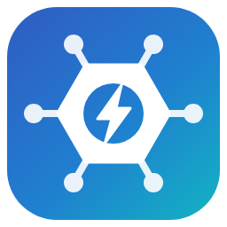
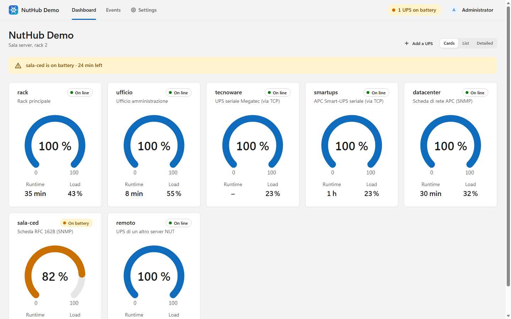
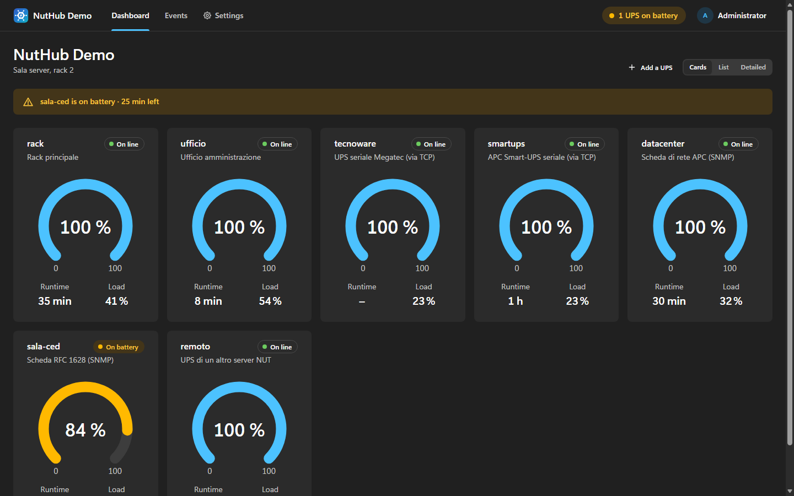
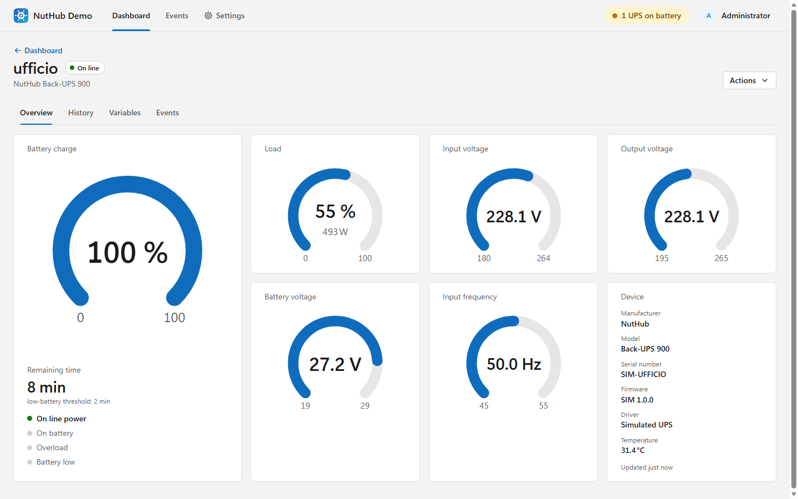
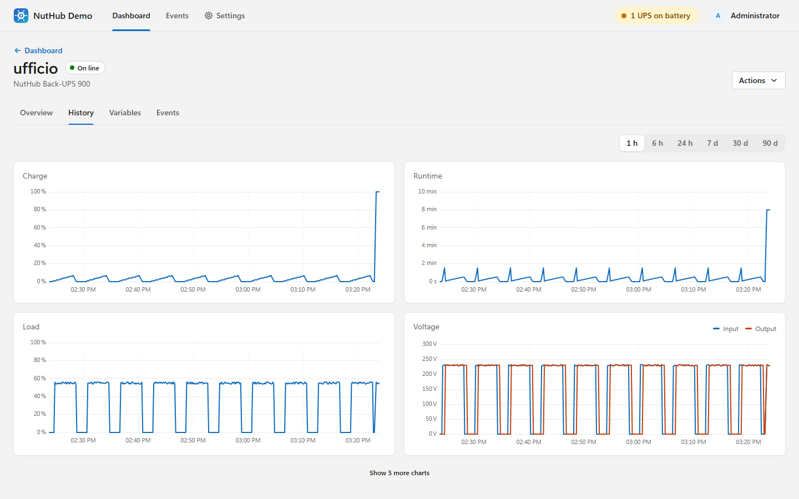
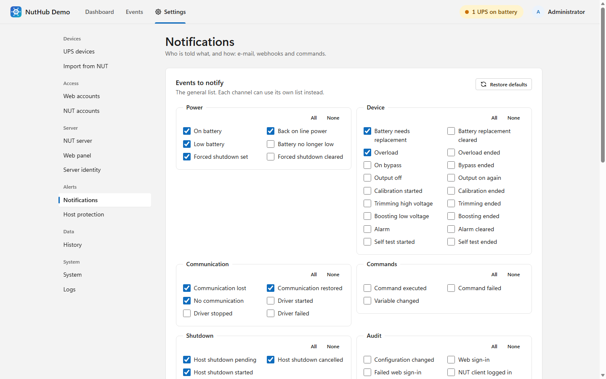

<p align="center">
  
</p>

<h1 align="center">NutHub</h1>

<p align="center">
  A UPS server compatible with <a href="https://networkupstools.org/">Network UPS Tools</a>, for Windows, Linux and Docker.<br>
  Many UPSes in one place, a web panel to watch and manage them, and every NUT client still works.
</p>

<p align="center">
  <a href="https://github.com/kriseniprak/NutHub/releases/latest"></a>
  <a href="https://github.com/kriseniprak/NutHub/actions/workflows/build.yml"></a>
  <a href="LICENSE"></a>
</p>

---

## What NutHub is

NutHub does the job of the NUT server (`upsd` and its drivers) as a single program. It talks to your UPSes over
USB, serial lines or the network, and serves them on TCP port 3493 with the NUT network protocol. `upsmon`, `upsc`,
`upscmd`, `upsrw`, [NutDesk](https://github.com/kriseniprak/NutDesk), WinNUT, Home Assistant and Synology/QNAP NAS
units connect to it exactly as they would to `upsd`. On top of that it has a web panel for monitoring and
administration, history charts, an event log and notifications.

- **Windows and Linux** (x64, arm64 and 32-bit arm, so a Raspberry Pi works too), as a Windows service, a systemd
  unit or a Docker container. One self-contained executable, no runtime to install.
- **Any number of UPSes at once**, each with its own driver, added, changed and removed from the web panel without
  restarting anything.
- **Drivers** for USB HID UPSes (APC, Eaton, CyberPower, Tripp Lite and many more), Megatec/Q1 and APC Smart serial
  UPSes, SNMP network cards (v1, v2c and v3), other NUT servers and apcupsd.
- **NUT protocol 1.3** (NUT 2.8), tested with the official NUT 2.8.5 and 2.7.4 clients: `upsmon` primary and
  secondary (including the forced-shutdown sequence), `upsc`, `upscmd` with tracking, `upsrw`. STARTTLS, accounts
  with the rights of `upsd.users`, and a client network allow-list.
- **Web panel**: live dashboard, details of every variable, history charts from one hour to 90 days, instant commands
  and variable writes, event log, and every setting. English and Italian, light and dark theme, works on phones.
- **Notifications** by email (with an outbox that survives outages), webhooks (ntfy, Telegram, Slack, Teams,
  Discord, Gotify...) and scripts.
- **Host protection**: NutHub can shut down the machine it runs on when its UPS runs out, after telling the NUT
  clients to shut down first, like `upsmon` in primary mode.

## Screenshots

| Dashboard (light) | Dashboard (dark) |
|---|---|
|  |  |

| UPS details | History | Settings |
|---|---|---|
|  |  |  |

The dashboard can also be shown as a compact list or with every value on each card; the phone layout keeps the
same pages ([screenshot](docs/screenshots/phone-dark.png)).

## Supported devices

| Driver | For | Connection |
|---|---|---|
| `usbhid` | USB UPSes of the HID Power Device class: APC, Eaton/MGE, CyberPower, Tripp Lite, Belkin, Liebert/Vertiv, PowerCOM, Delta, Salicru, Legrand, Ever, iDowell, OpenUPS, EcoFlow, Powervar, Arduino... (the subdriver tables of NUT's `usbhid-ups`) | USB |
| `winbattery` | Any UPS Windows already shows as a battery (Windows only), when the USB device is claimed by Windows | Windows battery class |
| `megatec` | UPSes speaking the Megatec / Q1 / Voltronic protocols (NUT's `nutdrv_qx` and `blazer`): Tecnoware, Atlantis Land, Mecer, PowerWalker, many OEM brands | Serial port, TCP serial server (ser2net), USB-serial bridges |
| `apcsmart` | APC Smart-UPS with a serial port (NUT's `apcsmart`) | Serial port, TCP serial server |
| `snmp` | UPS network cards: RFC 1628 UPS-MIB, APC PowerNet, Eaton/Powerware, MGE, CyberPower, Socomec Netvision, Huawei, Delta... (NUT's `snmp-ups`) | SNMP v1, v2c, v3 |
| `nut` | A UPS of another NUT server (a NAS, another NutHub, a Linux box) | NUT protocol, optional STARTTLS |
| `apcupsd` | A UPS managed by apcupsd | apcupsd NIS (TCP 3551) |
| `simulated` | A virtual UPS for trying NutHub and testing clients; can also replay a NUT `.dev` file | none |

## Installation

Download the archive for your system from the [Releases](https://github.com/kriseniprak/NutHub/releases) page.

### Windows

1. Extract `nuthub-<version>-win-x64.zip`.
2. In an administrator PowerShell, in that folder:

   ```powershell
   powershell -ExecutionPolicy Bypass -File .\install.ps1 -AddFirewallRules
   ```

   This copies `nuthub.exe` to `C:\Program Files\NutHub`, installs and starts the **NutHub** service, and opens TCP
   ports 3493 and 8493 in Windows Firewall. `-Uninstall` removes it (add `-Purge` to delete the data too).

Configuration and data live in `%ProgramData%\NutHub`.

### Linux

```bash
tar xzf nuthub-<version>-linux-x64.tar.gz
cd nuthub-<version>-linux-x64
sudo ./install.sh
```

The script installs `/opt/nuthub/nuthub`, creates the `nuthub` system account, the systemd unit, the udev rule that
gives that account access to USB UPSes, and the polkit rule that lets it power the machine off (host protection).
Run it again to upgrade; `sudo ./install.sh --uninstall` removes NutHub (`--purge` also removes the data). Use the
`linux-arm64` archive on 64-bit Raspberry Pi OS and `linux-arm` on 32-bit.

The configuration is `/etc/nuthub/nuthub.json`; data (database, logs, keys) is in `/var/lib/nuthub`. Serial UPSes
need the `nuthub` account in the `dialout` group, which the unit adds.

### Docker

```bash
cd packaging/docker
docker compose up -d --build
```

`docker-compose.yml` publishes ports 3493 and 8493 and keeps the configuration and data in two volumes. Network
drivers (SNMP, NUT, apcupsd) work as they are; for a USB or serial UPS pass the device into the container (examples
in the file). A container cannot shut down its host: for host protection install NutHub on the host, or run
`upsmon` on the machines to protect.

### On a NAS (UGREEN, Synology, QNAP)

NutHub runs in the Docker / Container Manager of a NAS like on any Linux host. Two things are specific:

- **Port 3493.** When the NAS's own UPS support is on, the NAS already runs a NUT server on port 3493, and a
  container that publishes the same port does not start at all (not even the web panel). Publish NutHub on another
  port, for example `"13493:3493"`, and give that port to the NUT clients.
- **Shutting the NAS down.** A container cannot power off its host, but the NAS can protect itself with NutHub's
  data. Either the NAS keeps its UPS on USB and NutHub reads it through the NAS's NUT server (driver `nut`, host =
  the NAS address, port 3493, UPS `ups0` on UGREEN, `ups` on Synology), or NutHub owns the data (network card,
  another server) and the NAS is a NUT client of NutHub. A Synology in "Synology UPS server" mode expects port 3493,
  a UPS named `ups` and the NUT account `monuser` / `secret`.

[docs/installation.md](docs/installation.md#on-a-nas) and [docs/clients.md](docs/clients.md) describe both
scenarios step by step.

### First sign-in

Open `http://<server>:8493/`. On its first start NutHub creates the web account **admin** with a random password,
saved in `initial-admin-password.txt` in the data directory (and printed on the console when it runs in a terminal):

- Windows: `%ProgramData%\NutHub\initial-admin-password.txt`
- Linux: `/var/lib/nuthub/initial-admin-password.txt`
- Docker: `docker compose exec nuthub cat /var/lib/nuthub/initial-admin-password.txt`

You are asked to choose a new password at the first sign-in; delete the file afterwards. A forgotten password can
be reset with `nuthub passwd admin`.

## Using it

### Adding UPSes

**Administration > UPS devices > Add a UPS**: choose the driver, press **Discover** for USB and serial devices, fill
in the connection details and save. The UPS appears on the dashboard within seconds. Existing NUT installations can
be brought over with **Import from NUT**: paste `ups.conf` and `upsd.users` and NutHub maps the drivers and
accounts it supports.

Per UPS you can also override values the device reports (NUT's `override.*`) and let NutHub declare "low battery"
at a charge or runtime of your choice, for UPSes that report it too late.

### Connecting NUT clients

Reading data needs no account, as with `upsd`. Clients that log in (`upsmon`) or send commands need a **NUT
account** (Administration > NUT accounts, the equivalent of `upsd.users`):

| Role | Can |
|---|---|
| upsmon secondary | `LOGIN`: be counted as a system powered by the UPS |
| upsmon primary | `LOGIN`, `PRIMARY`, `FSD`: set a forced shutdown |
| Actions `SET` / `FSD` | Write variables / set a forced shutdown |
| Instant commands | `ALL` or a list, for `upscmd` |

`upsmon.conf` on a machine powered by the UPS `rack` of NutHub at `192.168.1.10`:

```
MONITOR rack@192.168.1.10 1 monuser <password> secondary
```

NAS units have fixed names when they act as NUT clients: a Synology looks for the UPS `ups` with the account
`monuser` / `secret`, a QNAP for the UPS `qnapups` with `admin` / `123456`. Give the UPS that name in NutHub and
create that NUT account (secondary) to use them without changes.

**NutDesk** / WinNUT: server `192.168.1.10`, port 3493, the UPS name, and a NUT account if you want it to log in.

### Web panel

- **Viewer** accounts see the dashboard, details, history and events.
- **Operator** accounts can also send instant commands, write variables and set or clear a forced shutdown.
- **Admin** accounts manage everything.

The read-only views can optionally be opened without signing in (Administration > Web panel). HTTPS uses your
certificate or a self-signed one generated on first use.

### Notifications

Administration > Notifications: choose the events (on battery, low battery, communication lost, replace battery,
forced shutdown...), then any number of channels. Every channel has a **Send test** button and the last deliveries are
listed with their result. Email messages that cannot be sent are kept and retried for 24 hours; events that happen
together are grouped in one message. Webhook presets fill in the URL and body for ntfy, Telegram, Slack, Microsoft
Teams, Discord and Gotify. A command receives the event in environment variables, including upsmon's `NOTIFYTYPE`
and `UPSNAME`.

### Host protection

Administration > Host protection shuts down the machine NutHub runs on when fewer than the required number of its
UPSes can power it: on battery with a low battery, or below a charge or runtime you choose, or on battery for too
long, or after a forced shutdown, or when communication is lost while on battery. It then:

1. waits the grace period you set (cancelled if the power comes back, or from the panel);
2. sets the forced shutdown (FSD) on the UPS, so that the NUT clients shut down first, and waits for them to log out;
3. optionally tells the UPS to turn its output off after a delay and back on when mains power returns;
4. runs the shutdown command (`shutdown /s` on Windows, `systemctl poweroff` on Linux, or your own).

Try it first with **Dry run**, which does everything except the shutdown and the UPS power-off.

## Documentation

| Guide | What it covers |
|---|---|
| [Installation](docs/installation.md) | Windows, Linux, Docker and NAS installs, first sign-in, upgrades, backup and restore |
| [Configuration](docs/configuration.md) | Every setting of the panel and of `nuthub.json`, and every driver with its options |
| [Clients and machines to protect](docs/clients.md) | upsmon, NutDesk, NAS systems, Home Assistant, the NUT command-line tools |
| [Troubleshooting](docs/troubleshooting.md) | Symptoms, checks and fixes; logs; reporting a problem |
| [Architecture](docs/ARCHITECTURE.md) and [web API](docs/API.md) | For developers and integrations |

## Command line

```
nuthub run [--data-dir DIR] [--config FILE]      run in the foreground (what the service runs)
nuthub service install|uninstall|start|stop|status   manage the Windows service / systemd unit
nuthub passwd <web-user> [--password P | --generate]  set a web account password
nuthub nut-user list|add|set-password|remove <name>   manage NUT accounts
nuthub devices                                    list the USB and serial UPSes the drivers find
nuthub check-config                               validate the configuration
nuthub healthcheck                                exit code 0 when the local server answers
nuthub version | help
```

`nuthub help` describes every option. The configuration file can also be edited by hand: NutHub applies the
changes while running. Secrets in it (SMTP password, SNMP communities, webhook tokens...) are encrypted with a key kept
in the data directory.

## Security notes

- The NUT protocol sends passwords in clear text. Enable STARTTLS (Administration > NUT server) when your clients
  support it, and restrict the client networks.
- Every UPS can be read by anyone who reaches port 3493, as with `upsd`; use the allow-list and your firewall.
- The web panel uses session cookies, rejects cross-site requests, limits sign-in attempts and sends a strict
  Content Security Policy. Enable HTTPS when it is reachable from untrusted networks.

## Building from source

Requirements: the .NET 10 SDK.

```bash
dotnet build NutHub.sln
dotnet test NutHub.sln
dotnet run --project src/NutHub -- run --data-dir ./data
```

Release archives: `tools/package-release.sh` (or `tools/package-release.ps1`) builds the self-contained single-file
executables for `win-x64`, `linux-x64`, `linux-arm64` and `linux-arm` into `dist/`, with a SHA-256 file per archive.
`tools/fake-serial-ups` and `tools/fake-snmp-agent` simulate serial and SNMP UPSes for manual tests.

The design is described in [docs/ARCHITECTURE.md](docs/ARCHITECTURE.md) and the web API in [docs/API.md](docs/API.md).

## Credits

NutHub implements the network protocol of [Network UPS Tools](https://networkupstools.org/), uses the variable and
command descriptions of NUT's `cmdvartab`, and ports the device mapping tables of NUT's drivers (`usbhid-ups`,
`nutdrv_qx`, `apcsmart`, `snmp-ups`). NUT is GPL-2.0-or-later; many thanks to its developers.

Libraries: [HidSharp](https://www.zer7.com/software/hidsharp) (USB HID), [SharpSnmpLib](https://github.com/lextudio/sharpsnmplib)
(SNMP), [MailKit](https://github.com/jstedfast/MailKit) (email) and Microsoft.Data.Sqlite.

## Licence

GPL-3.0-or-later. See [LICENSE](LICENSE).
